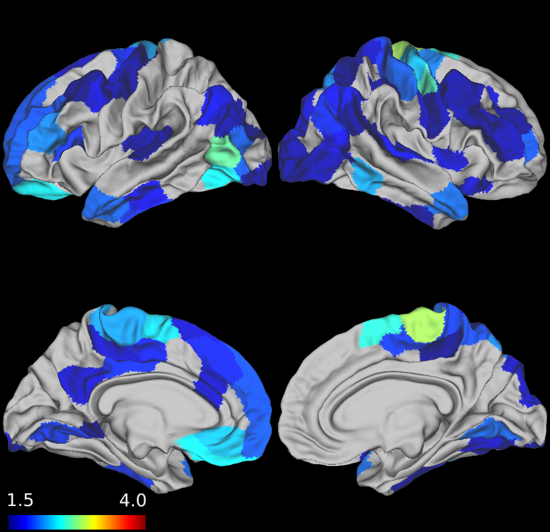

# Neuroprint

Neuroprint is a software pipeline/[Flywheel gear](https://github.com/willtack/neuroprint-fw) for calculating statistical deviation in cortical thickness from expected values for a healthy individual of the same age and sex. These expected values are derived from a [dataset of healthy controls](https://github.com/willtack/healthy-t1-dataset) (n=868) spanning the adult age range which were collected from various centers at Penn. The highest-quality T1w image was processed with the [ANTs Cortical Thickness pipeline](https://www.sciencedirect.com/science/article/pii/S1053811914004091?via%3Dihub) to calculate cortical thickness values in 200 cortical regions delineated by the [Schaefer 2018 atlas](https://github.com/ThomasYeoLab/CBIG/tree/master/stable_projects/brain_parcellation/Schaefer2018_LocalGlobal). A linear regression was performed for each region based on that region’s mean cortical thickness value for the 868 subjects, with age and sex as covariates.

For a given patient, the gear takes the same regional cortical thickness values and the patient’s age and sex and calculates a w-score (essentially a weighted z-score) using the following formula. Note that the score is multiplied by -1 so that higher w-scores reflect greater degeneration.

_w-score =-(raw ct val - intercept - age\*agecoefficient - sex\*sexcoefficient) / standard error residuals_

The result is a score for each region describing the difference in that region’s observed cortical thickness compared to that of a healthy control. The gear renders these scores in a 3D model.

 

